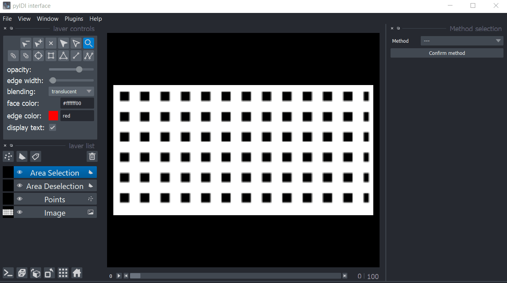

[](https://pyidi.readthedocs.io/en/latest/?badge=latest)


# pyidi
Image-based Displacement Identification (IDI) implementation in python.

See the [documentation](https://pyidi.readthedocs.io/en/latest/index.html) for `pyIDI`.

## Now version 1.0!

In version 1.0, **we overhauled the package API**. With growing usage in IDEs other than
jupyter notebooks, we have made the package more user-friendly. The new API allows the
autocompletion and documentation of the package to be more accessible in IDEs like
VSCode, Cursor, PyCharm, etc.

To install the new version, use the following command:

```bash
pip install pyidi
```
or to upgrade (if already installed):
```bash
pip install -U pyidi
```

### Whats different?

For the user, the main difference is that instead of calling the `pyIDI` class where the
method is set, first, the `VideoReader` class is called. Then, this instance is passed
to the specific method class. Here is an example:

```python
from pyidi import VideoReader, SimplifiedOpticalFlow

# Read the video
video = VideoReader('video.cih')

# Pass the video to the selected method class
sof = SimplifiedOpticalFlow(video)

sof.set_points(points=[[0, 1], [1, 1], [2, 1]])
sof.configure(...)
displacements = sof.get_displacements()
```

The methods themselves have not changed, only the way they are called. Unfortunately, this
breaks the backward compatibility with the previous version. We apologize for any
inconvenience this may cause. To keep using the old version, please install the package
with the following command:

```bash
pip install pyidi==0.30.2
```

or use the legacy `pyIDI` class:

```python
from pyidi import pyIDI
```

Note that the legacy `pyIDI` class does not necessarily offer the full functionality of the new version. 
The legacy `pyIDI` class is only kept for compatibility with the old version and will not be updated.


# Use Napari UI for quick displacement identification:



# BASIC USAGE:
Run GUI by instantiating GUI class (input is VideoReader object):
```python
from pyidi import VideoReader, GUI

# Read the video
video = VideoReader('data/data_synthetic.cih')

# Run GUI
gui = GUI(video)
```

Method class (e.g. `SimplifiedOpticalFlow`) is instantiated during the use of GUI. It is accessible in `gui.method`. To get displacements:

```python
method = gui.method
displacements = method.displacements
```

The `pyIDI` method works with various formats: `.cih`, `.cihx`, `.png`, `.avi` etc. Additionally, it can also work with `numpy.ndarray` as input.
If an array is passed, it must have a shape of: ``(n time points, image height, image width)``.

Set the points where displacements will be determined:
```
p = np.array([[0, 1], [1, 1], [2, 1]]) # example of points
video.set_points(points=p)
```
Or use point selection UI to set individual points or grid inside selected area. For more information about UI see [documentation](https://pyidi.readthedocs.io/en/quick_start/napari.html). Launch viewer with:


# DEVELOPER GUIDELINES:
* Add _name_of_method.py with class that inherits after `IDIMethods`
* This class must have methods:
	* `calculate_displacements` with attribute `displacements`
	* `get_points` (static method - sets attribute video.points)
* In `pyIDI` add a new method of identification in `avaliable_methods` dictionary.

# Citing
If you are using the `pyIDI` package for your research, consider citing our articles:
- Masmeijer, T., Habtour, E., Zaletelj, K., & Slavič, J. (2024). **Directional DIC method with automatic feature selection**. Mechanical Systems and Signal Processing, 224 . https://doi.org/10.1016/j.ymssp.2024.112080
- Čufar, K., Slavič, J., & Boltežar, M. (2024). **Mode-shape magnification in high-speed camera measurements**. Mechanical Systems and Signal Processing, 213, 111336. https://doi.org/10.1016/J.YMSSP.2024.111336
- Zaletelj, K., Gorjup, D., Slavič, J., & Boltežar, M. (2023). **Multi-level curvature-based parametrization and model updating using a 3D full-field response**. Mechanical Systems and Signal Processing, 187, 109927. https://doi.org/10.1016/j.ymssp.2022.109927
- Zaletelj, K., Slavič, J., & Boltežar, M. (2022). **Full-field DIC-based model updating for localized parameter identification**. Mechanical Systems and Signal Processing, 164. https://doi.org/10.1016/j.ymssp.2021.108287
- Gorjup, D., Slavič, J., & Boltežar, M. (2019). **Frequency domain triangulation for full-field 3D operating-deflection-shape identification**. Mechanical Systems and Signal Processing, 133. https://doi.org/10.1016/j.ymssp.2019.106287

[](https://doi.org/10.5281/zenodo.4017153)
[](https://travis-ci.com/ladisk/pyidi)

