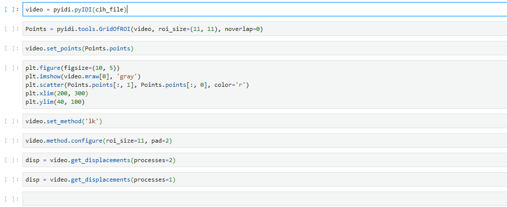

# pyidi
Image-based Displacement Identification (IDI) implementation in python.

The documentation for this repository is accessible [here](https://pyidi.readthedocs.io/en/latest/index.html).

# BASIC USAGE:


Create an instance:
```
v = pyidi.pyIDI(cih_file='video.cih')
```
Currently the pyIDI method works with Photron ``.cih`` and ``.cihx`` files, however, ``numpy.ndarray`` can
also be passed as ``cih_file`` argument. If an array is passed, it must have a shape of: ``(n time points, image height, image width)``.

Set the points where displacements will be determined. In this step the method of identification is specified.

If `points` is given, these are the ones used:
```
p = np.array([[0, 1], [1, 1], [2, 1]]) # example of points
v.set_points(points=p)
```
The method of identification has to be specified:
```
v.set_method(method='sof', **method_kwargs)
```
To further configure the method parameters, use:
```
v.method.configure(*args, **kwargs)
```

After the points are set, displacements can be calculated (using method, set in `set_method`):
```
displacements = v.get_displacements()
```
Multiprocessing can also be used by passing the `processes` argument:
```
displacements = v.get_displacements(processes=4)
```

# DEVELOPER GUIDELINES:
* Add _name_of_method.py with class that inherits after `IDIMethods`
* This class must have methods:
	* `calculate_displacements` with attribute `displacements`
	* `get_points` (static method - sets attribute video.points)
* In `pyIDI` add a new method of identification in `avaliable_methods` dictionary.


[](https://doi.org/10.5281/zenodo.4017153)
[](https://travis-ci.com/ladisk/pyidi)

