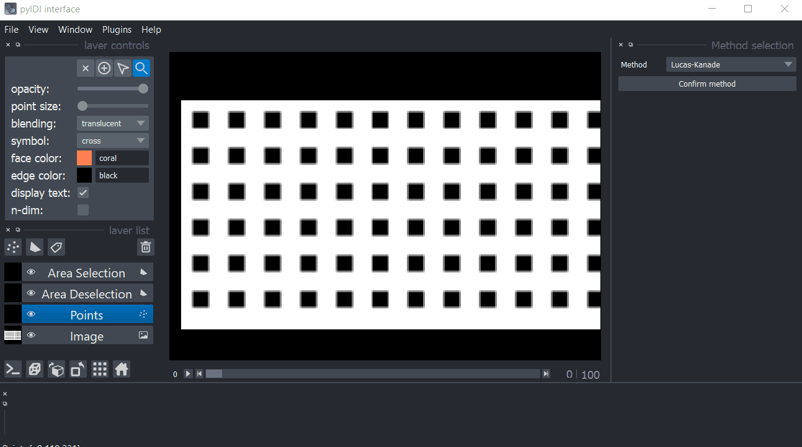
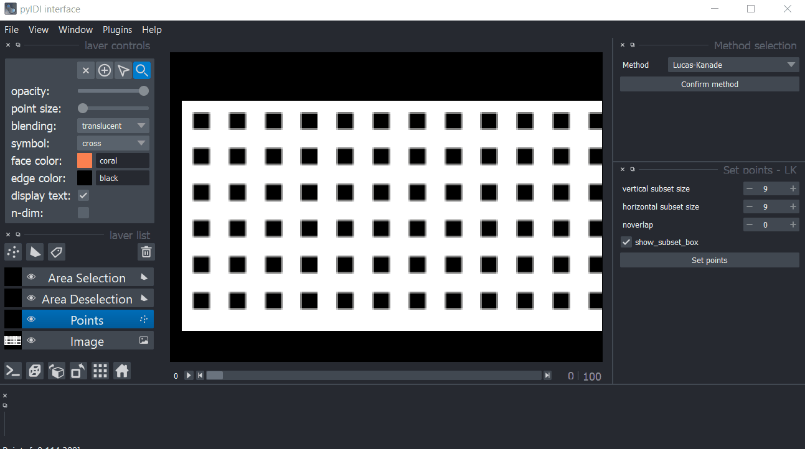
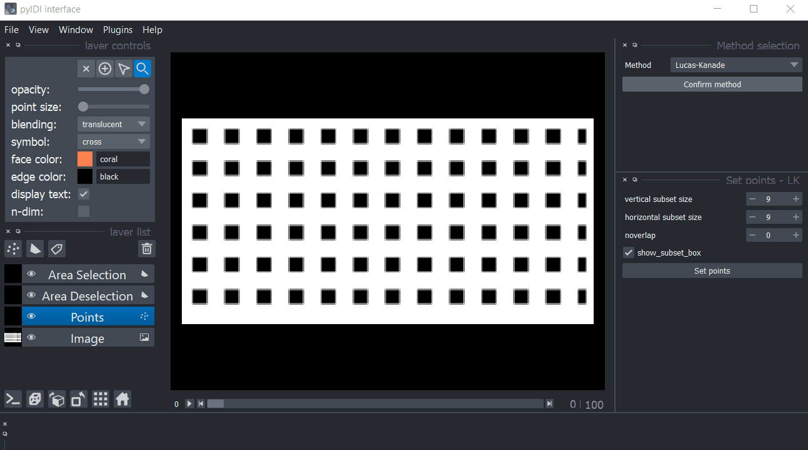
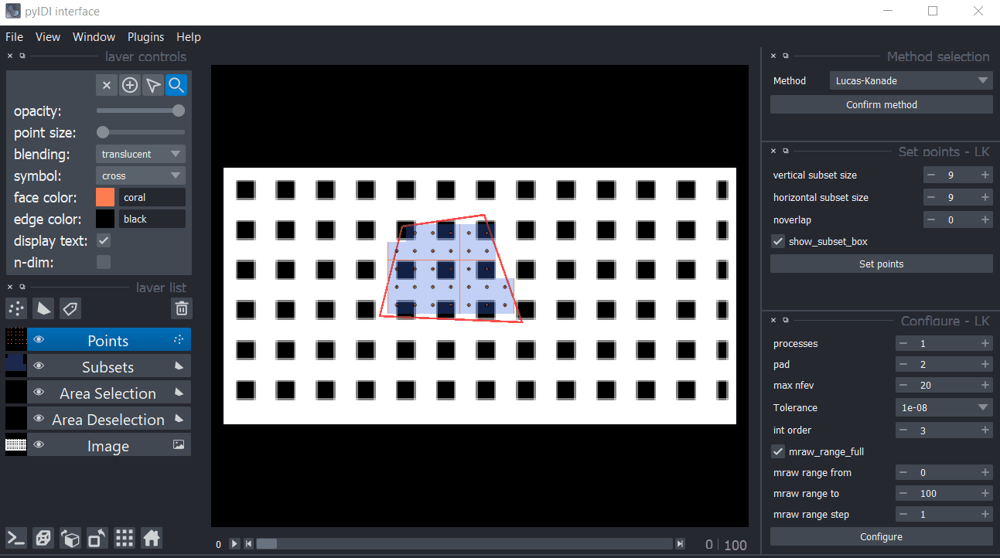

.. _napari:

Napari image viewer
=====================

Interactive image viewer **napari** is implemented and can be used for viewing video and selecting points. More information about napari can be obtained `here <https://napari.org/>`_.

Basic usage
------------
To use the image viewer, the ``VideoReader`` object must first be available. It can be created by:

    
.. code:: python

    video = VideoReader('cih_file')

Image viewer is launched by instantiating ``GUI`` object. Method object is created automatically during the use of GUI.

.. code:: python

    gui = GUI(video)

Viewer is divided in few key areas. On the left side from main canvas there are: layer controls (editing layer colors, brightness), layer buttons, layer list and viewer buttons. On the right side there is a dock widget used for point selection. Slider below the canvas can be used for scrolling through video. By selecting image layer from layer list you can toggle layer visibility and adjust video colors or lightning.

.. image:: viewer_controls.gif
     :width: 800

Setting the method
------------------

Individual points selection
-----------------------------
To select individual points, choose ``Points`` from layer list on the left side. Then choose ``Add points`` button from layer control or press ``P`` key.
Select points by clicking on screen, use ``space`` to zoom and move across image. By choosing ``Select points`` button from layer control or pressing ``S`` key and selecting points on canvas, points can be moved, deleted or scaled with ``point size`` slider.
Points are added to ``gui.method`` object in ``gui.method.points`` by pressing ``Set points`` on the right side of UI.

Area selection
---------------
To select an area for creating a grid of points, choose ``Area selection`` from layer list. Then under layer controls choose ``Add rectange`` (``R`` key) or ``Add polygons`` (``P`` key). When drawing polygons, press ``esc`` key to stop adding points. An area inside of already selected area can be deselected using ``Area deselection`` layer from layer list. Shapes can be moved, scaled, edited and deleted using ``Select vertices`` (``D`` key) and ``Select shapes`` (``S`` key) buttons form layer controls.
Grid parameters are set using dock on the right side from canvas. Grid is shown and points are added to ``gui.method`` object after pressing ``Set points``.

Configure
---------
Once the points are set, the method can be configured by editing the settings shown in the UI. All of the changes done in the UI change the attributes of the ``gui.method.`` object.

Displacement computation
------------------------
After the method is selected, the points are set and the configuration is performed, the displacements can be computed.

.. image:: gifs/napari_full_sof.gif
     :width: 800

Results
----------
After the computation is done, the method object can be accessed as ``gui.method``. 
Displacement results are stored in ``gui.method.displacements``.