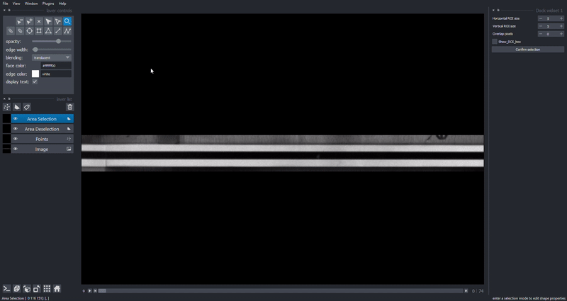
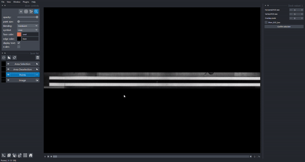

Napari image viewer
=====================

Interactive image viewer **napari** is implemented and can be used for viewing video and selecting points. More information about napari can be obtained `here <https://napari.org/>`_.

Installation
-------------

Napari can be installed on most systems using pip:

.. code:: python

    pip install napari

For using points selection UI, `magicgui <https://github.com/napari/magicgui>`_ is required. It can be installed using pip:

.. code:: python

    pip install magicgui

Basic usage
------------
To use the image viewer, the ``pyIDI`` object must first be available. It is created by:

    
.. code:: python

    video = pyidi.pyIDI('cih_file')

Image viewer is launched by calling ``pyIDI`` object as a function:

.. code:: python

    video()

If points in ``video.points`` are already given, image viewer with shown points will launch.

If no points are set in ``video.points``, point selection UI will launch. 

Viewer is divided in few key areas. On the left side from main canvas there are: layer controls (editing layer colors, brightness), layer buttons, layer list and viewer buttons. On the right side there is a dock widget used for point selection. Slider below the canvas can be used for playing and scrolling through video. By selecting image layer from layer list you can toggle layer visibility and adjust video colors or lightning.

.. image:: viewer_controls.gif
     :width: 800

Individual points selection
-----------------------------
To select individual points, choose ``Points`` from layer list on the left side. Then choose ``Add points`` button from layer control or press ``P`` key.
Select points by clicking on screen, use ``space`` to zoom and move across image. By choosing ``Select points`` button from layer control or pressing ``S`` key and selecting points on canvas, points can be moved, deleted or scaled with ``point size`` slider.
Points are added to ``pyIDI`` object in ``video.points`` by pressing ``Confirm selection`` on the right side from canvas.

Area selection
---------------
To select an area for creating a grid of points, choose ``Area selection`` from layer list. Then under layer controls choose ``Add rectange`` (``R`` key) or ``Add polygons`` (``P`` key). When drawing polygons, press ``esc`` key to stop adding points. An area inside of already selected area can be deselected using ``Area deselection`` layer from layer list. Shapes can be moved, scaled, edited and deleted using ``Select vertices`` (``D`` key) and ``Select shapes`` (``S`` key) buttons form layer controls.
Grid parameters are set using dock on the right side from canvas. Grid is shown and points are added to ``pyIDI`` object after pressing ``Confirm selection``.

    

