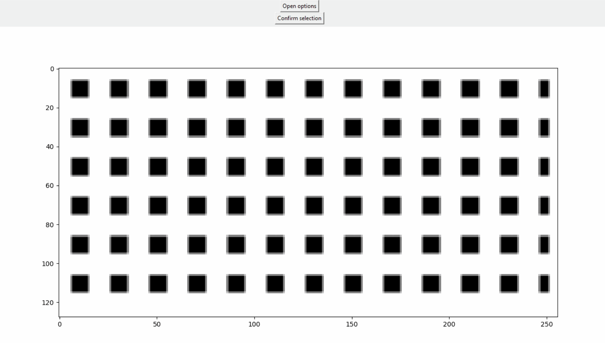

.. _point-selection:

Point selection UI
==================

A convinient UI is available to make the point selection easier.

To use the UI, the ``pyIDI`` object must first be available. It is created
by:

.. code:: python

    video = pyidi.pyIDI(cih_file)

A ``ROISelect`` object can then be created:

.. code:: python

    Points = pyidi.selection.ROISelect(video, roi_size=(21, 21), noverlap=0)

where ``roi_size`` is the size of a single Region-Of-Interest/subset in ``y`` and
``x`` direction respsectivly. The ``noverlap`` argument prescribes the overlap of the
neighbouring ROIs. The density of the grid can be adjusted using ``noverlap``.

The UI enables multiple modes of point selection. Currently, the following are
supported:

- ``ROI grid``: A regular grid of ROIs is created based on the selected polygon.
- ``Deselect ROI polygon``: After defining the polygon and getting the points, this method can
  be used to define a polygon within which the points are not selected.
- ``Only polygon``: Same as ROI grid but the points are not computed. Only polygon points
  are available.
- ``Manual ROI select``: Manually select the ROIs at desired locations.

